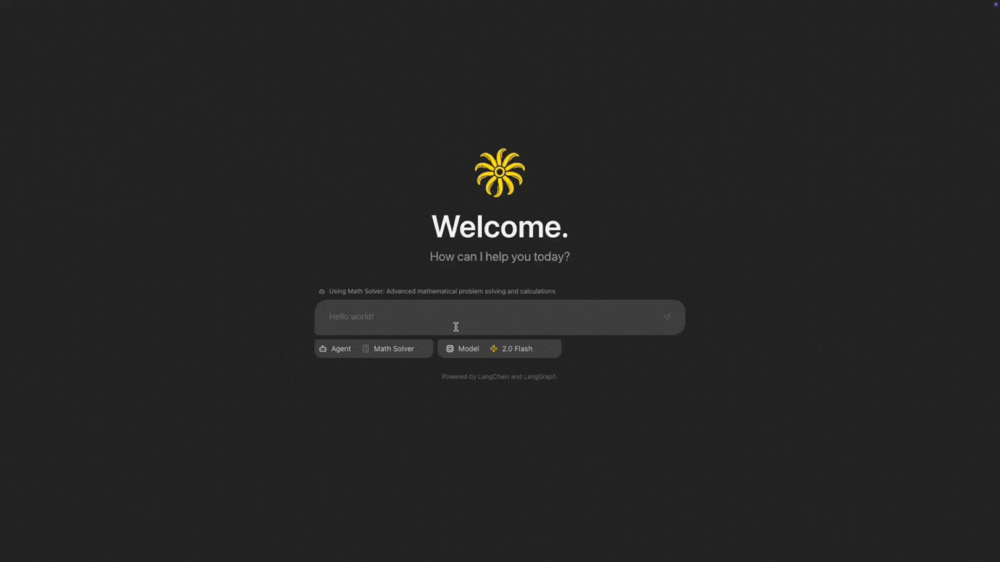
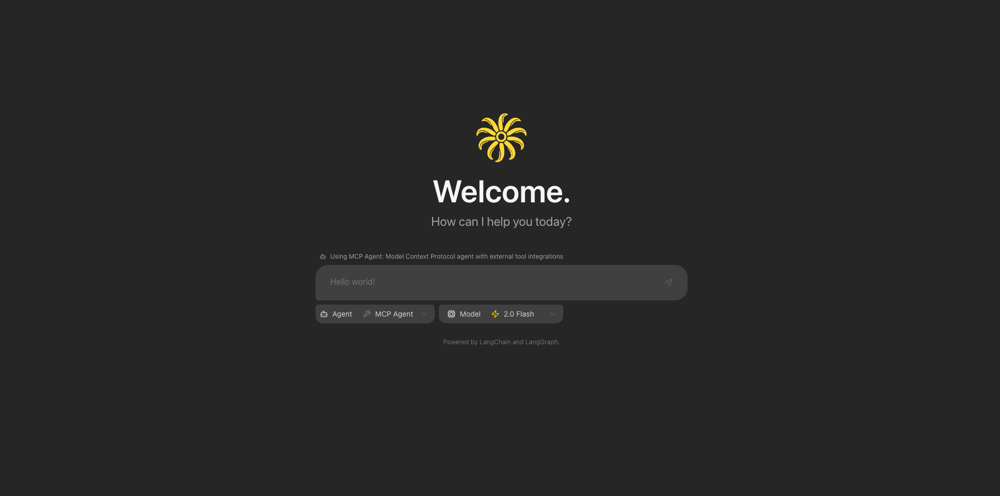
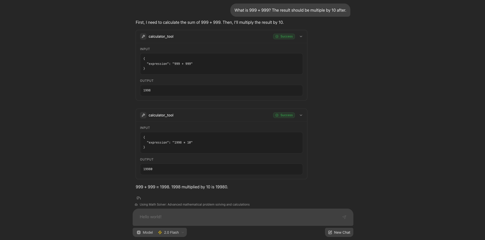
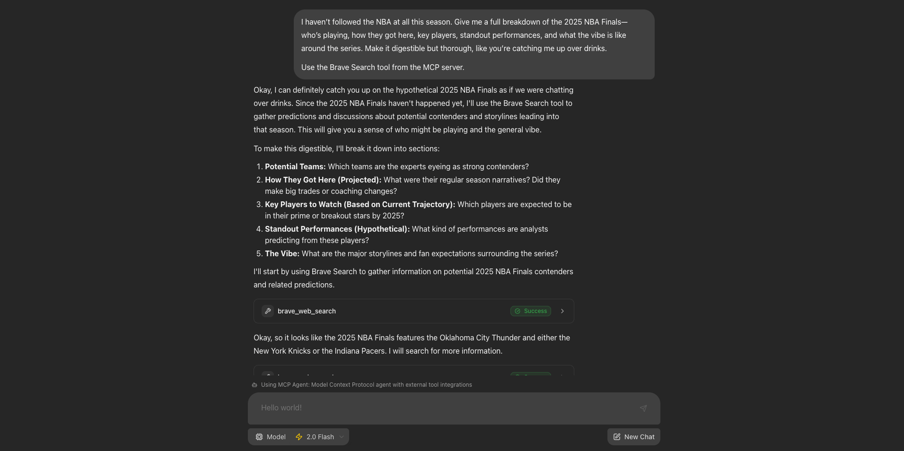
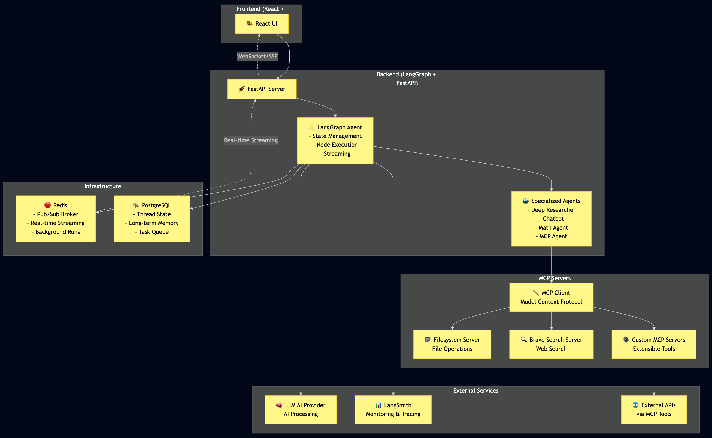

# 🚀 LangGraph React Agent Studio

_Built with ❤️ by [@artreimus](https://github.com/artreimus) from [Ylang Labs](https://github.com/ylang-labs)_

> **A powerful, extensible fullstack AI agent platform** - This is an enhanced fork of the original Gemini Fullstack LangGraph Quickstart, supercharged with **multiple specialized agents**, **MCP (Model Context Protocol) integration**, and **LangChain tools support**!

## 📸 Demo










## ✨ What Makes This Special

🎯 **Multiple Specialized Agents** - Choose from 4 powerful AI agents, each optimized for different tasks  
🔌 **MCP Integration** - First-class support for Model Context Protocol servers  
🏗️ **Built on LangChain & LangGraph** - Powered by LangChain and LangGraph for robust agentic applications  
⚡ **Real-time Streaming** - Watch your agents think and work in real-time  
🎨 **Beautiful UI** - Modern React interface with Tailwind CSS and Radix UI

## 🤖 Available Agents

This template comes with 4 example agents to get you started:

- **🔍 Deep Researcher** - Web research with iterative refinement
- **💬 Chatbot** - General conversation and assistance
- **🧮 Math Agent** - Mathematical calculations and problem-solving
- **🔧 MCP Agent** - Tool integration via Model Context Protocol

> **💡 Template Design** - These agents serve as examples to demonstrate the platform's capabilities. Use them as starting points to build your own specialized agents!

## 🚀 Quick Start

### Prerequisites

- Node.js 18+ and npm
- Python 3.8+
- **Gemini API Key** ([Get one here](https://ai.google.dev/))

### 1. Clone & Setup

```bash
git clone git@github.com:Ylang-Labs/langgraph-react-agent-studio.git
cd langgraph-react-agent-studio
```

### 2. Configure Environment

```bash
cd backend
cp .env.example .env
```

**Required Configuration:**

```bash
# Essential - Get your API key from https://ai.google.dev/
GEMINI_API_KEY=your_gemini_api_key_here
```

**Optional MCP & Tool Configuration:**

```bash
# MCP Filesystem (enabled by default)
MCP_FILESYSTEM_ENABLED=true
MCP_FILESYSTEM_PATH=/app/workspace

# MCP Brave Search (optional)
MCP_BRAVE_SEARCH_ENABLED=true
BRAVE_API_KEY=your_brave_api_key_here

# LangSmith (optional - for monitoring)
LANGSMITH_API_KEY=your_langsmith_api_key_here
```

### 3. Install Dependencies

```bash
# Backend
cd backend && uv sync

# Frontend
cd ../frontend && npm install
```

### 4. Launch the Studio

```bash
# From project root
make dev
```

🎉 **That's it!** Open `http://localhost:5173/app` and start chatting with your AI agents!

## 🔌 MCP (Model Context Protocol) Integration

This studio features cutting-edge MCP integration, allowing agents to seamlessly connect with external tools and services:

### 🗂️ Filesystem Server

- **Read/Write files** in your workspace
- **Directory operations** and file management
- **Secure sandboxed** file access

### 🔍 Brave Search Server

- **Web search capabilities** for real-time information
- **Search result processing** and filtering
- **Citation tracking** for reliable sources

### ⚙️ MCP Configuration

```bash
# Required
GEMINI_API_KEY=your_gemini_api_key_here

# MCP Filesystem (enabled by default)
MCP_FILESYSTEM_ENABLED=true
MCP_FILESYSTEM_PATH=/app/workspace

# MCP Brave Search (optional)
MCP_BRAVE_SEARCH_ENABLED=true
BRAVE_API_KEY=your_brave_api_key_here
```

## 🏗️ Architecture Overview

The platform is built with a modern, scalable architecture that separates concerns and enables easy extensibility:



### 🏛️ Architecture Layers

- **🎨 Frontend Layer** - Modern React application with TypeScript and real-time streaming UI
- **🚀 Backend Layer** - LangGraph-powered agent system with FastAPI for REST endpoints and WebSocket streaming
- **🏗️ Infrastructure Layer** - Redis for pub/sub streaming and PostgreSQL for state persistence and task queuing
- **🔧 MCP Layer** - Model Context Protocol integration for extensible tool ecosystem
- **☁️ External Services** - LLM AI providers, monitoring, and third-party API integrations

## 🎯 Platform Features

### ⚡ Real-time Agent Execution

- **Streaming responses** with live progress tracking
- **Activity timeline** showing agent thought processes
- **Tool execution** visibility and results

### 🔧 Extensible Architecture

- **Custom agent creation** - Build specialized agents for your use case
- **Tool integration** - Connect with external APIs and services
- **MCP protocol support** - Leverage the growing MCP ecosystem
- **LangChain compatibility** - Use the full LangChain tools library

## 🚀 Deployment

### Production Architecture

In production, the backend server serves the optimized static frontend build. LangGraph requires specific infrastructure components for reliable operation:

- **Redis** - Used as a pub-sub broker to enable streaming real-time output from background runs
- **PostgreSQL** - Stores assistants, threads, runs, persists thread state and long-term memory, and manages the state of the background task queue with 'exactly once' semantics

For comprehensive deployment guidance, see the [LangGraph Documentation](https://langchain-ai.github.io/langgraph/concepts/deployment_options/).

### Docker Deployment

**1. Build the Docker Image**

Run from the **project root directory**:

```bash
docker build -t langgraph-agent-studio -f Dockerfile .
```

**2. Run with Docker Compose**

```bash
GEMINI_API_KEY=<your_gemini_api_key> LANGSMITH_API_KEY=<your_langsmith_api_key> docker-compose up
```

Access the application at `http://localhost:8123/app/` - The API will be available at `http://localhost:8123`.

### Configuration Notes

- **LangSmith API Key**: Required for the docker-compose example. Get one from [LangSmith](https://smith.langchain.com/settings)
- **API URL Configuration**: If not using docker-compose or exposing to public internet, update the `apiUrl` in `frontend/src/App.tsx`:
  - Docker Compose: `http://localhost:8123`
  - Development: `http://localhost:2024`

### Production Checklist

- ✅ **Environment Variables** - Secure API key management
- ✅ **Redis Configuration** - For state management and streaming
- ✅ **PostgreSQL Setup** - For data persistence
- ✅ **HTTPS Configuration** - For secure communications
- ✅ **Rate Limiting** - Protect API endpoints
- ✅ **Monitoring** - LangSmith integration for observability

## 🛡️ Security & Best Practices

- **Environment Variables** - Secure API key management
- **Input Validation** - Prevents injection attacks
- **Rate Limiting** - Protects against abuse
- **Sandboxed Execution** - Isolated tool operations
- **CORS Configuration** - Secure cross-origin requests

## 🤝 Contributing

We love contributions! Here's how you can help:

1. **🐛 Bug Reports** - Found an issue? Let us know!
2. **💡 Feature Ideas** - Have a cool agent idea? Share it!
3. **🔧 Code Contributions** - Submit PRs for improvements
4. **📚 Documentation** - Help improve our docs
5. **🧪 Testing** - Help us test new features

### Development Workflow

```bash
# Fork the repo
git clone https://github.com/YOUR_USERNAME/langgraph-react-agent-studio.git

# Create feature branch
git checkout -b feature/amazing-new-feature

# Make changes and test
make dev

# Submit PR
git push origin feature/amazing-new-feature
```

## 📚 Learn More

- **[LangGraph Documentation](https://langchain-ai.github.io/langgraph/)** - Core framework
- **[Model Context Protocol](https://modelcontextprotocol.io/)** - MCP specification
- **[LangChain Tools](https://python.langchain.com/docs/integrations/tools/)** - Tool ecosystem
- **[React 19](https://react.dev/)** - Frontend framework
- **[Tailwind CSS](https://tailwindcss.com/)** - Styling system

## 💖 Acknowledgments

- **Original Project** - Built on the excellent [Gemini Fullstack LangGraph Quickstart](https://github.com/langchain-ai/langgraph/tree/main/examples/quickstart-fullstack)
- **LangChain Team** - For the amazing LangGraph framework
- **Anthropic** - For Model Context Protocol innovation
- **Community** - For feedback, contributions, and support

## 📄 License

This project is licensed under the Apache License 2.0. See the [LICENSE](LICENSE) file for details.

---

<div align="center">

**⭐ If you find this project useful, please give it a star! ⭐**

Built with ❤️ by [@artreimus](https://github.com/artreimus) from [Ylang Labs](https://github.com/ylang-labs)

[🐛 Report Bug](https://github.com/artreimus/langgraph-react-agent-studio/issues) • [💡 Request Feature](https://github.com/artreimus/langgraph-react-agent-studio/issues) • [💬 Discussions](https://github.com/artreimus/langgraph-react-agent-studio/discussions)

</div>
